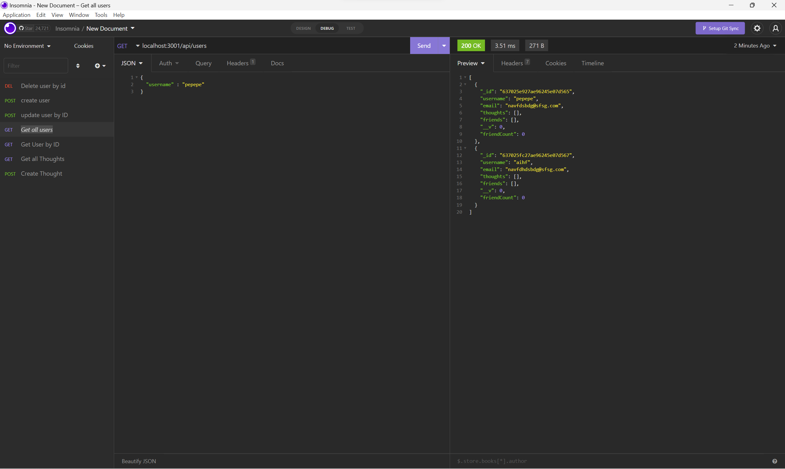

## social-network-api

# Link to demo vid

[Link to demo video](https://drive.google.com/file/d/1w3Zn85FfeYChEhya4W6xKH_1Gx-OuZo6/view)

## Table of Contents

- [Description](#Description)
- [Usage](#Usage)
- [License](#license)
- [Contributing](#Contributing)
- [Questions](#questions)

## Project title :

social network api

## Description :

This is a server that runs a database on no sql with the aid of MongoDB

## Installation :

All dependencies are required to be installed for the use of this app

## Usage :

## Contributing ;

## linkedin :

## Github ;

Affiiiffff

## License :

Boost Software License 1.0

## Questions

If you have any questions about this projects, please contact me directly at afifpatel@hotmail.co.uk. You can view more of my projects at https://github.com/Affiiiffff.

## Table of Contents

- [Description](#Description)
- [Usage](#Usage)
- [License](#license)
- [Contributing](#Contributing)
- [Questions](#questions)

## Project title :

social network api

## Description :

This is a server that runs a database on no sql with the aid of MongoDB

## Installation :

All dependencies are required to be installed for the use of this app

## Usage :

## Contributing ;

## linkedin :

## Github ;

Affiiiffff

## License :

Boost Software License 1.0

## Questions

If you have any questions about this projects, please contact me directly at afifpatel@hotmail.co.uk. You can view more of my projects at https://github.com/Affiiiffff.
